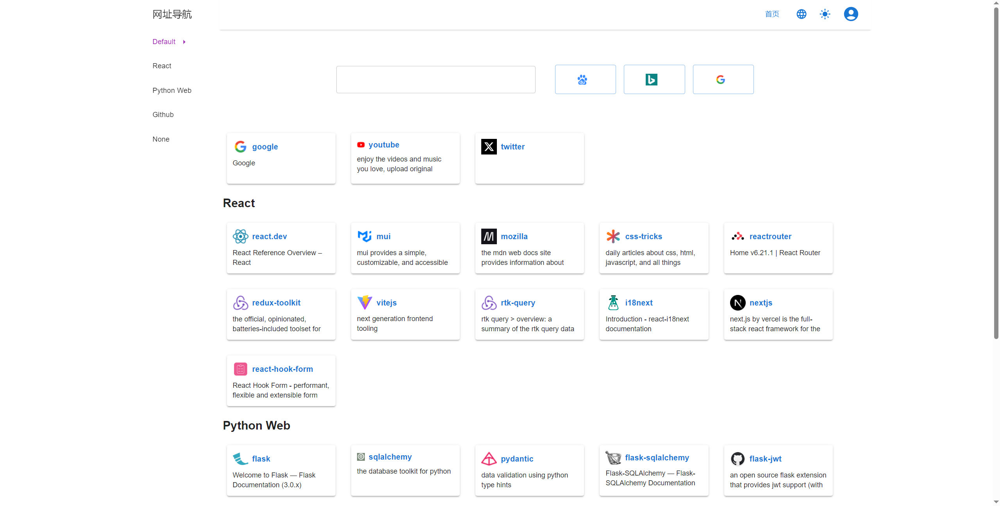
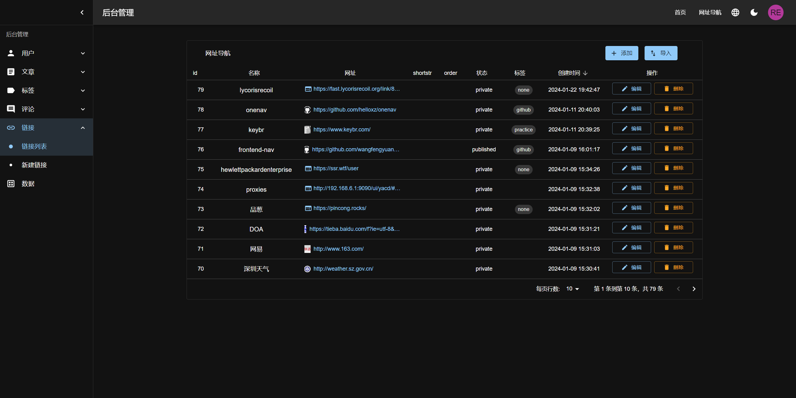
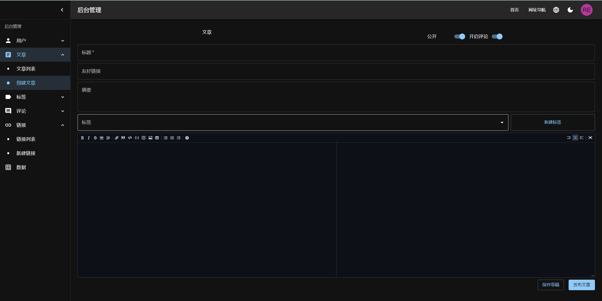

# wisp

## Description

wisp 是一个包含博客、网址导航的个人技术网站，使用 react + flask 开发。

- 个人博客支持 Markdown 编辑预览
- 支持代码语法高亮
- 可以文章多标签
- 支持登录评论文章进行互动
- 支持后台管理增删改查
- 添加链接自动获取 logo 和网站描述
- 支持 chrome 书签批量导入导出
- 中文英文，dark light 切换
- 使用 React 进行前端开发，Flask 用于构建后端 API
- 支持用 Docker Compose 本地开发


<p align="center">
  
</p>


<p align="center">
  
</p>

<p align="center">
  
</p>

- UI 组件库使用 MUI 
- 前端页面路由使用 React Router 
- 数据获取缓存使用 RTK Query
- 前端数据校验使用 React Hook Form
- 后端数据校验使用 Pydantic
- 数据库ORM使用 SQLAlchemy Flask-SQLAlchemy
- 单元测试使用 pytest

## Installation

1. 克隆项目:

   ```sh
   git clone  https://github.com/liustan9012/wisp.git
   ```

2. 后端创建虚拟环境并安装依赖：

   创建 python 虚拟环境，激活虚拟环境

   ```sh
   cd flask-app
   python -m venv venv
   source venv/bin/activate
   ```

   使用 pip 安装依赖

   ```
    pip install -r requirements.txt
   ```

3. 运行 Flask:

   创建后端数据库，默认使用 sqlite，更新数据库表。

   ```
   flask db upgrade
   ```

   创建管理员用户，

   ```
   flask  create admin
   ```

   后端配置信息可以修改文件`.flaskenv`或者环境变量

   - `DATABASE_URL` 用于连接的数据库
   - `ADMIN_USERNAME`、`ADMIN_EMAIL`、`ADMIN_PASSWORD`、用于创建管理员信息
   - `JWT_SECRET_KEY` 用于编码和解码 JWT 的密钥，应为随机字符。

   启动

   ```
   flask run
   ```

   使用 gunicorn 启动

   ```
   gunicorn -b 127.0.0.1:5100  wispblog:app -D
   ```

4. 前端安装依赖

   ```
   cd ../react-app
   npm install
   ```

   启动

   ```
   npm run dev
   ```

5. 使用 Docker Compose：

   ```
   docker-compose up -d
   ```
